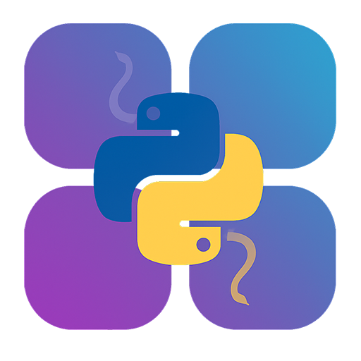
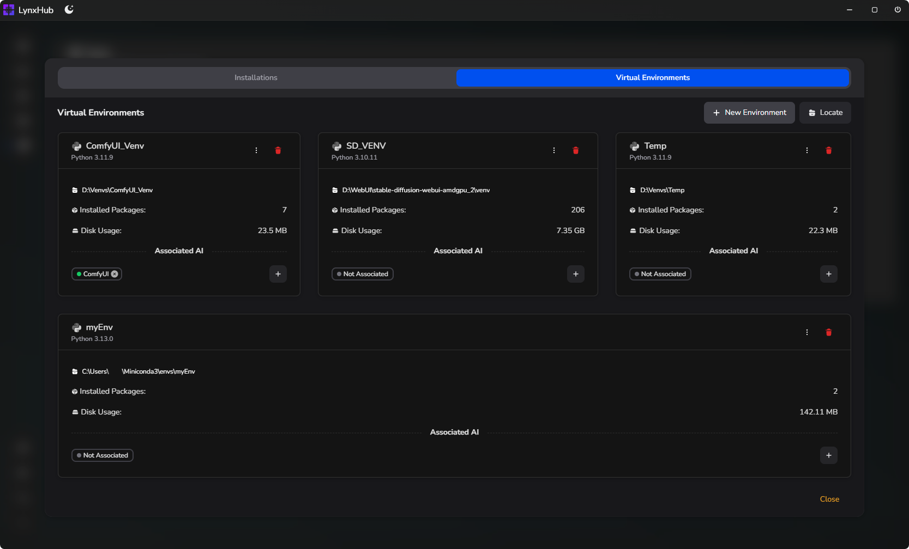
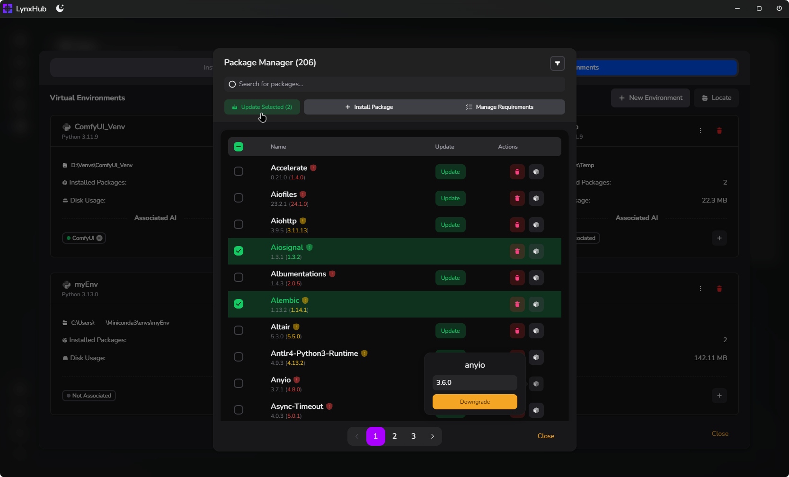
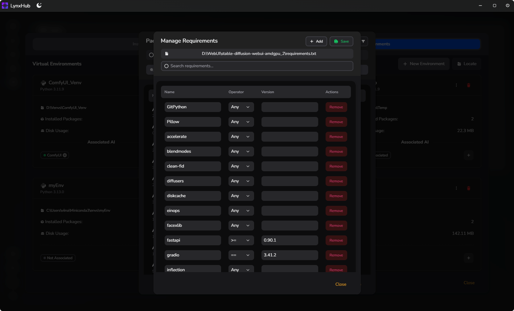

# [LynxHub](https://github.com/KindaBrazy/LynxHub) Python Toolkit Extension

**Python Toolkit Extension** is a powerful tool designed to streamline Python environment management within the
[**LynxHub**](https://github.com/KindaBrazy/LynxHub) platform. It offers comprehensive features for managing Python
installations, virtual environments, and packages.

[![GitHub Release][github-release-shield]](https://github.com/KindaBrazy/LynxHub-Module-Offline-Container/releases)
[![GitHub Release Date][github-release-date-shield]](https://github.com/KindaBrazy/LynxHub-Module-Offline-Container/releases)
[![GitHub Repo stars][github-repo-stars-shield]](https://github.com/KindaBrazy/LynxHub-Module-Offline-Container)

 

## 📚 Table of Contents

- [🗺️ Roadmap](#-roadmap)
- [🚀 Features](#-features)
    - [🐍 Python Management](#-python-management)
    - [🌐 Virtual Environment](#-virtual-environment)
    - [📦 Package Manager](#-package-manager)
    - [📝 Requirements Manager](#-requirements-manager)
    - [🤖 AI Integration](#-ai-integration)
    - [🛠️ Tools Page Integration](#-tools-page-integration)
- [📸 Screenshots](#-screenshots)
- [⬇️ Installation](#-installation)
- [🤝 Contribution](#-contribution)
- [📄 License](#-license)

## 🗺️ Roadmap

- [x] **Linux** support.
- [ ] **macOS** support.
- [x] Use`conda activate`for Conda environments.
- [ ] Merge`requirements.txt`files and manage conflicts.
- [ ] Improve package installation:
    - Show`pip`output, progress bar, and download size (MB).
- [X] Optimize disk usage calculations and caching.
- [x] Refresh only Python/venv on changes, no full reload.
- [ ] Expand tools page to full screen.
- [x] Activate Python/venv during AI installation.
- [ ] Check for Python version updates and auto-update on startup.
- [ ] Show detailed errors for installations/updates.
- [ ] Add settings to disable auto venv assignment for AIs.
- [ ] Set a default venv for all AIs.
- [x] Change package version (upgrade/downgrade)

## 🚀 Features

### 🐍 Python Management

- **Auto-Detect Installed Pythons:** Automatically detects all installed Python versions, including those installed via
  Conda.
- **Install Python Versions:** Install new Python versions (official and Conda-based) directly from the extension.
- **Set System Default Python:** Easily set any installed Python as the system default.
- **Manage Installed Packages:** Manage packages installed in each Python environment.
- **View Python Details:** View detailed information about installed Pythons, including version, install path, installed
  packages count, and disk usage.

### 🌐 Virtual Environment

- **Locate Existing Venvs:** Locate and list existing virtual environments.
- **Create New Venv:** Create new virtual environments with selected Python versions (official or Conda).
- **Associate AI with Venv:** Associate AI tools with specific virtual environments, allowing multiple AIs to share the
  same environment.
- **View Venv Details:** View detailed information about virtual environments, including Python version, install path,
  installed packages count, disk usage, and associated AIs.
- **Manage Venv Packages:** Manage packages installed in virtual environments.

### 📦 Package Manager

- **Check for Updates:**
    - Check for updates for all installed packages.
    - Check for updates based on requirements files.
- **Update Manager:**
    - Interactively update packages.
    - Categorize and colorize updates based on update type (prerelease, major, minor, patch, others).
    - Filter updates by type and choose to update all or select packages.
- **Install Packages:**
    - Select and install multiple packages with version conditions.
    - Install packages from a requirements file.
    - View a preview of script before installation.
- **Manage Requirements:**
    - Manage requirements files and their associated packages.

### 📝 Requirements Manager

- **Select and Change Requirements File:** Easily switch between different requirements files.
- **Add, Remove, and Change Requirements:** Modify requirements in a user-friendly interface.

### 🤖 AI Integration

- **New Menu Item for Package and Requirement Management:** Direct access to package and requirement management from the
  AI menu.

### 🛠️ Tools Page Integration

- **New Card for Individual Toolkit:** Open and manage individual pythons from a dedicated card on the tools page.

## 📸 Screenshots

- **Python Management:**
    - 
- **Virtual Environment Management:**
    - 
- **Package Manager:**
    - 
- **Requirements Manager:**
    - 

## ⬇️ Installation

1. **[Install LynxHub](https://github.com/KindaBrazy/LynxHub):** Ensure that you have LynxHub installed on your system.
2. **Install Extension:** Install the Python Toolkit Extension from the LynxHub extension page.

## 🤝 Contribution

Contributions are welcome! If you'd like to contribute to the project, please follow these steps:

1. Fork the repository.
2. Create a new branch for your feature or bug fix.
3. Make your changes and commit them.
4. Submit a pull request.

> [!NOTE]
> The source code for this extension is available in the `source_ea` branch.

---

## 📄 License

This project is licensed under the **MIT License**.

[github-release-shield]:https://img.shields.io/github/v/release/KindaBrazy/LynxHub-Python-Toolkit?include_prereleases&style=flat&labelColor=%23212121&color=%2300A9FF&label=Version&logo=data:image/svg+xml;base64,PHN2ZyB4bWxucz0iaHR0cDovL3d3dy53My5vcmcvMjAwMC9zdmciIHdpZHRoPSIxZW0iIGhlaWdodD0iMWVtIiB2aWV3Qm94PSIwIDAgMjQgMjQiPjxwYXRoIGZpbGw9IndoaXRlIiBmaWxsLXJ1bGU9ImV2ZW5vZGQiIGQ9Ik0xNCAyMmgtNGMtMy43NzEgMC01LjY1NyAwLTYuODI4LTEuMTcyQzIgMTkuNjU3IDIgMTcuNzcxIDIgMTR2LTRjMC0zLjc3MSAwLTUuNjU3IDEuMTcyLTYuODI4QzQuMzQzIDIgNi4yMzkgMiAxMC4wMyAyYy42MDYgMCAxLjA5MSAwIDEuNS4wMTdjLS4wMTMuMDgtLjAyLjE2MS0uMDIuMjQ0bC0uMDEgMi44MzRjMCAxLjA5NyAwIDIuMDY3LjEwNSAyLjg0OGMuMTE0Ljg0Ny4zNzUgMS42OTQgMS4wNjcgMi4zODZjLjY5LjY5IDEuNTM4Ljk1MiAyLjM4NSAxLjA2NmMuNzgxLjEwNSAxLjc1MS4xMDUgMi44NDguMTA1aDQuMDUyYy4wNDMuNTM0LjA0MyAxLjE5LjA0MyAyLjA2M1YxNGMwIDMuNzcxIDAgNS42NTctMS4xNzIgNi44MjhDMTkuNjU3IDIyIDE3Ljc3MSAyMiAxNCAyMiIgY2xpcC1ydWxlPSJldmVub2RkIiBvcGFjaXR5PSIwLjUiLz48cGF0aCBmaWxsPSJ3aGl0ZSIgZD0iTTEwLjU2IDE1LjQ5OGEuNzUuNzUgMCAxIDAtMS4xMi0uOTk2bC0yLjEwNyAyLjM3bC0uNzcyLS44N2EuNzUuNzUgMCAwIDAtMS4xMjIuOTk2bDEuMzM0IDEuNWEuNzUuNzUgMCAwIDAgMS4xMiAwem0uOTUtMTMuMjM4bC0uMDEgMi44MzVjMCAxLjA5NyAwIDIuMDY2LjEwNSAyLjg0OGMuMTE0Ljg0Ny4zNzUgMS42OTQgMS4wNjcgMi4zODVjLjY5LjY5MSAxLjUzOC45NTMgMi4zODUgMS4wNjdjLjc4MS4xMDUgMS43NTEuMTA1IDIuODQ4LjEwNWg0LjA1MmMuMDEzLjE1NS4wMjIuMzIxLjAyOC41SDIyYzAtLjI2OCAwLS40MDItLjAxLS41NmE1LjMyMiA1LjMyMiAwIDAgMC0uOTU4LTIuNjQxYy0uMDk0LS4xMjgtLjE1OC0uMjA0LS4yODUtLjM1N0MxOS45NTQgNy40OTQgMTguOTEgNi4zMTIgMTggNS41Yy0uODEtLjcyNC0xLjkyMS0xLjUxNS0yLjg5LTIuMTYxYy0uODMyLS41NTYtMS4yNDgtLjgzNC0xLjgxOS0xLjA0YTUuNDg4IDUuNDg4IDAgMCAwLS41MDYtLjE1NGMtLjM4NC0uMDk1LS43NTgtLjEyOC0xLjI4NS0uMTR6Ii8+PC9zdmc+

[github-release-date-shield]:https://img.shields.io/github/release-date-pre/KindaBrazy/LynxHub-Python-Toolkit?style=flat&labelColor=%23212121&color=%2300A9FF&label=Date&logo=data:image/svg+xml;base64,PHN2ZyB4bWxucz0iaHR0cDovL3d3dy53My5vcmcvMjAwMC9zdmciIHdpZHRoPSIxZW0iIGhlaWdodD0iMWVtIiB2aWV3Qm94PSIwIDAgMjQgMjQiPjxwYXRoIGZpbGw9IndoaXRlIiBkPSJNNi45NiAyYy40MTggMCAuNzU2LjMxLjc1Ni42OTJWNC4wOWMuNjctLjAxMiAxLjQyMi0uMDEyIDIuMjY4LS4wMTJoNC4wMzJjLjg0NiAwIDEuNTk3IDAgMi4yNjguMDEyVjIuNjkyYzAtLjM4Mi4zMzgtLjY5Mi43NTYtLjY5MnMuNzU2LjMxLjc1Ni42OTJWNC4xNWMxLjQ1LjEwNiAyLjQwMy4zNjggMy4xMDMgMS4wMDhjLjcuNjQxLjk4NSAxLjUxMyAxLjEwMSAyLjg0MnYxSDJWOGMuMTE2LTEuMzI5LjQwMS0yLjIgMS4xMDEtMi44NDJjLjctLjY0IDEuNjUyLS45MDIgMy4xMDMtMS4wMDhWMi42OTJjMC0uMzgyLjMzOS0uNjkyLjc1Ni0uNjkyIi8+PHBhdGggZmlsbD0id2hpdGUiIGQ9Ik0yMiAxNHYtMmMwLS44MzktLjAxMy0yLjMzNS0uMDI2LTNIMi4wMDZjLS4wMTMuNjY1IDAgMi4xNjEgMCAzdjJjMCAzLjc3MSAwIDUuNjU3IDEuMTcgNi44MjhDNC4zNDkgMjIgNi4yMzQgMjIgMTAuMDA0IDIyaDRjMy43NyAwIDUuNjU0IDAgNi44MjYtMS4xNzJDMjIgMTkuNjU3IDIyIDE3Ljc3MSAyMiAxNCIgb3BhY2l0eT0iMC41Ii8+PHBhdGggZmlsbD0id2hpdGUiIGQ9Ik0xOCAxNi41YTEuNSAxLjUgMCAxIDEtMyAwYTEuNSAxLjUgMCAwIDEgMyAwIi8+PC9zdmc+

[github-repo-stars-shield]:https://img.shields.io/github/stars/KindaBrazy/LynxHub-Python-Toolkit?style=flat&labelColor=%23212121&color=%2300A9FF&label=Stars&logo=data:image/svg+xml;base64,PHN2ZyB4bWxucz0iaHR0cDovL3d3dy53My5vcmcvMjAwMC9zdmciIHdpZHRoPSIxZW0iIGhlaWdodD0iMWVtIiB2aWV3Qm94PSIwIDAgMjQgMjQiPjxwYXRoIGZpbGw9IndoaXRlIiBmaWxsLXJ1bGU9ImV2ZW5vZGQiIGQ9Ik0xMiAxNmE3IDcgMCAxIDAgMC0xNGE3IDcgMCAwIDAgMCAxNG0wLTEwYy0uMjg0IDAtLjQ3NC4zNC0uODU0IDEuMDIzbC0uMDk4LjE3NmMtLjEwOC4xOTQtLjE2Mi4yOS0uMjQ2LjM1NGMtLjA4NS4wNjQtLjE5LjA4OC0uNC4xMzVsLS4xOS4wNDRjLS43MzguMTY3LTEuMTA3LjI1LTEuMTk1LjUzMmMtLjA4OC4yODMuMTY0LjU3Ny42NjcgMS4xNjVsLjEzLjE1MmMuMTQzLjE2Ny4yMTUuMjUuMjQ3LjM1NGMuMDMyLjEwNC4wMjEuMjE1IDAgLjQzOGwtLjAyLjIwM2MtLjA3Ni43ODUtLjExNCAxLjE3OC4xMTUgMS4zNTJjLjIzLjE3NC41NzYuMDE1IDEuMjY3LS4zMDNsLjE3OC0uMDgyYy4xOTctLjA5LjI5NS0uMTM1LjM5OS0uMTM1Yy4xMDQgMCAuMjAyLjA0NS4zOTkuMTM1bC4xNzguMDgyYy42OTEuMzE5IDEuMDM3LjQ3NyAxLjI2Ny4zMDNjLjIzLS4xNzQuMTkxLS41NjcuMTE1LTEuMzUybC0uMDItLjIwM2MtLjAyMS0uMjIzLS4wMzItLjMzNCAwLS40MzhjLjAzMi0uMTAzLjEwNC0uMTg3LjI0Ny0uMzU0bC4xMy0uMTUyYy41MDMtLjU4OC43NTUtLjg4Mi42NjctMS4xNjVjLS4wODgtLjI4Mi0uNDU3LS4zNjUtMS4xOTUtLjUzMmwtLjE5LS4wNDRjLS4yMS0uMDQ3LS4zMTUtLjA3LS40LS4xMzVjLS4wODQtLjA2NC0uMTM4LS4xNi0uMjQ2LS4zNTRsLS4wOTgtLjE3NkMxMi40NzQgNi4zNCAxMi4yODQgNiAxMiA2IiBjbGlwLXJ1bGU9ImV2ZW5vZGQiLz48cGF0aCBmaWxsPSJ3aGl0ZSIgZD0iTTYuNzE0IDE3LjMyM0w3LjM1MSAxNUw4IDEzaDhsLjY0OSAybC42MzcgMi4zMjNjLjYyOCAyLjI5Mi45NDIgMy40MzguNTIzIDQuMDY1Yy0uMTQ3LjIyLS4zNDQuMzk2LS41NzMuNTEzYy0uNjUyLjMzMi0xLjY2LS4xOTMtMy42NzUtMS4yNDNjLS42Ny0uMzUtMS4wMDYtLjUyNC0xLjM2Mi0uNTYyYTEuODcgMS44NyAwIDAgMC0uMzk4IDBjLS4zNTYuMDM4LS42OTEuMjEzLTEuMzYyLjU2MmMtMi4wMTUgMS4wNS0zLjAyMyAxLjU3NS0zLjY3NSAxLjI0M2ExLjUyMSAxLjUyMSAwIDAgMS0uNTczLS41MTNjLS40Mi0uNjI3LS4xMDUtMS43NzMuNTIzLTQuMDY1IiBvcGFjaXR5PSIwLjUiLz48L3N2Zz4=