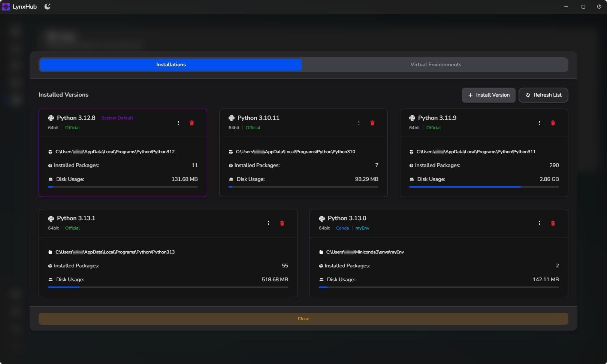
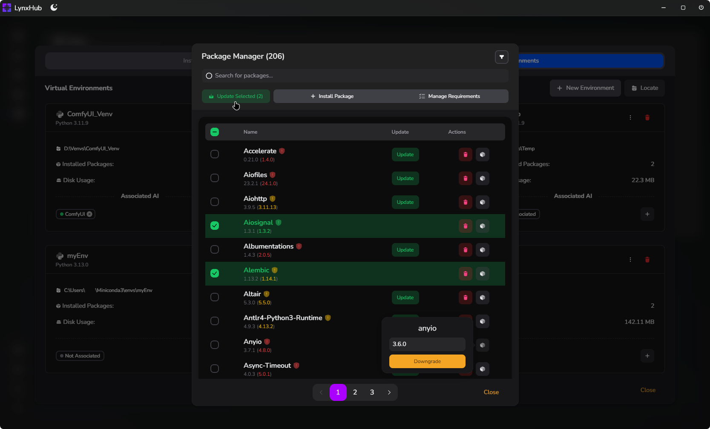
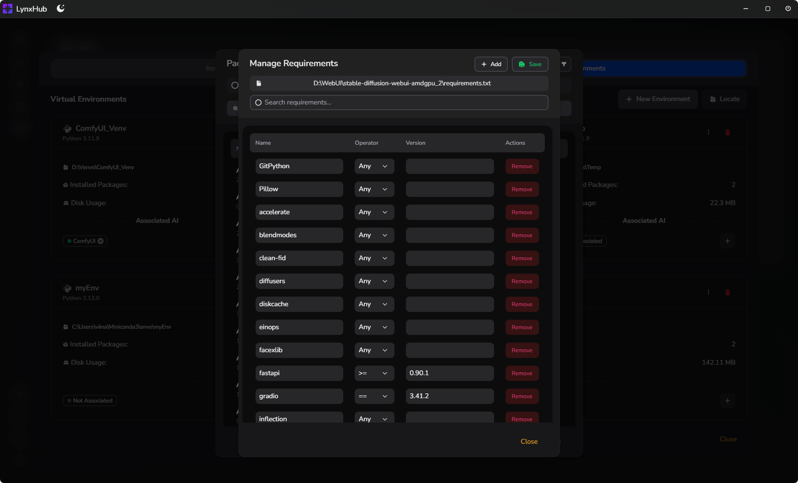

# [LynxHub](https://github.com/KindaBrazy/LynxHub) Python Toolkit Extension

**Python Toolkit Extension** is a powerful tool designed to streamline Python environment management within the
[**LynxHub**](https://github.com/KindaBrazy/LynxHub) platform. It offers comprehensive features for managing Python
installations, virtual environments, and packages.

 

## 📚 Table of Contents

- [🗺️ Roadmap](#-roadmap)
- [🚀 Features](#-features)
  - [🐍 Python Management](#-python-management)
  - [🌐 Virtual Environment](#-virtual-environment)
  - [📦 Package Manager](#-package-manager)
  - [📝 Requirements Manager](#-requirements-manager)
  - [🤖 AI Integration](#-ai-integration)
  - [🛠️ Tools Page Integration](#-tools-page-integration)
- [📸 Screenshots](#-screenshots)
- [⬇️ Installation](#-installation)
- [🤝 Contribution](#-contribution)
- [📄 License](#-license)

## 🚀 Features

### 🐍 Python Management

- **Auto-Detect Installed Pythons:** Automatically detects all installed Python versions, including those installed via
  Conda.
- **Install Python Versions:** Install new Python versions (official and Conda-based) directly from the extension.
- **Set System Default Python:** Easily set any installed Python as the system default.
- **Manage Installed Packages:** Manage packages installed in each Python environment.
- **View Python Details:** View detailed information about installed Pythons, including version, install path, installed
  packages count, and disk usage.

### 🌐 Virtual Environment

- **Locate Existing Venvs:** Locate and list existing virtual environments.
- **Create New Venv:** Create new virtual environments with selected Python versions (official or Conda).
- **Associate AI with Venv:** Associate AI tools with specific virtual environments, allowing multiple AIs to share the
  same environment.
- **View Venv Details:** View detailed information about virtual environments, including Python version, install path,
  installed packages count, disk usage, and associated AIs.
- **Manage Venv Packages:** Manage packages installed in virtual environments.

### 📦 Package Manager

- **Check for Updates:**
  - Check for updates for all installed packages.
  - Check for updates based on requirements files.
- **Update Manager:**
  - Interactively update packages.
  - Categorize and colorize updates based on update type (prerelease, major, minor, patch, others).
  - Filter updates by type and choose to update all or select packages.
- **Install Packages:**
  - Select and install multiple packages with version conditions.
  - Install packages from a requirements file.
  - View a preview of script before installation.
- **Manage Requirements:**
  - Manage requirements files and their associated packages.

### 📝 Requirements Manager

- **Select and Change Requirements File:** Easily switch between different requirements files.
- **Add, Remove, and Change Requirements:** Modify requirements in a user-friendly interface.

### 🤖 AI Integration

- **New Menu Item for Package and Requirement Management:** Direct access to package and requirement management from the
  AI menu.

### 🛠️ Tools Page Integration

- **New Card for Individual Toolkit:** Open and manage individual pythons from a dedicated card on the tools page.

## 📸 Screenshots

- **Python Management:**
  - 
- **Virtual Environment Management:**
  - 
- **Package Manager:**
  - 
- **Requirements Manager:**
  - 

## ⬇️ Installation

1. **[Install LynxHub](https://github.com/KindaBrazy/LynxHub):** Ensure that you have LynxHub installed on your system.
2. **Install Extension:** Install the Python Toolkit Extension from the LynxHub extension page.

## 🤝 Contribution

Contributions are welcome! If you'd like to contribute to the project, please follow these steps:

1. Fork the repository.
2. Create a new branch for your feature or bug fix.
3. Make your changes and commit them.
4. Submit a pull request.

> [!NOTE]
> The source code for this extension is available in the `source_ea` branch.

---

## 📄 License

This project is licensed under the **MIT License**.
