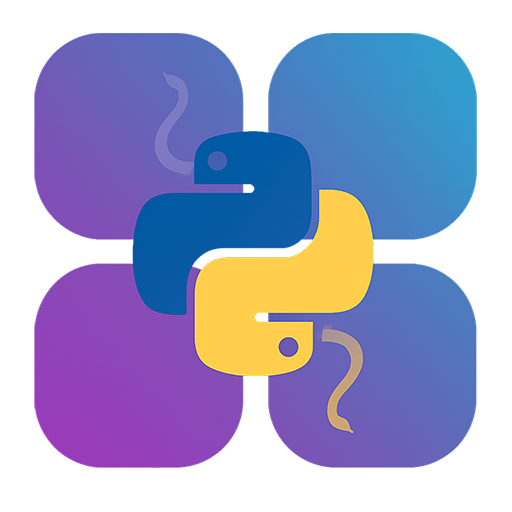
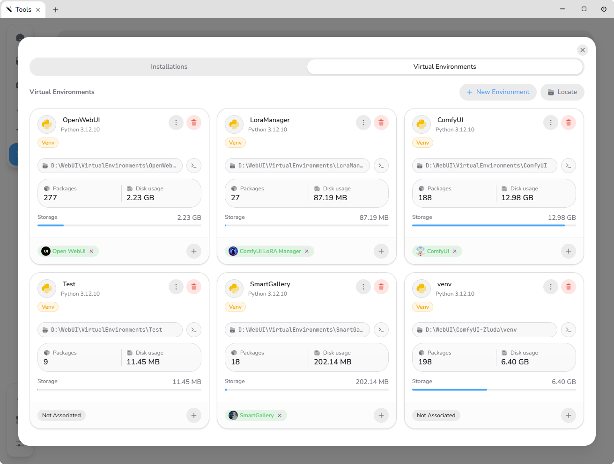

# [LynxHub](https://github.com/KindaBrazy/LynxHub) Python Toolkit Extension

**Python Toolkit Extension** brings Python installation, virtual environment, package, and requirements management into
[**LynxHub**](https://github.com/KindaBrazy/LynxHub). It is built for managing Python-backed AI tools and modules without
leaving the LynxHub workspace.

 

## 📚 Table of Contents

- [🚀 What it can do](#-what-it-can-do)
  - [🐍 Python Management](#-python-management)
  - [🌐 Virtual Environments](#-virtual-environments)
  - [📦 Package Manager](#-package-manager)
  - [📝 Requirements Manager](#-requirements-manager)
  - [🤖 LynxHub Integration](#-lynxhub-integration)
- [⚙️ Settings](#-settings)
- [📸 Screenshots](#-screenshots)
- [⬇️ Installation](#-installation)
- [🤝 Contribution](#-contribution)
- [📄 License](#-license)

## 🚀 What it can do

### 🐍 Python Management

- **Auto-detect Python installations:** Finds installed Python versions, including Conda installations, and keeps them
  available inside LynxHub.
- **Install Python versions:** Install official Python builds or Conda-based versions directly from the extension.
- **Locate existing Python executables:** Manually add an already-installed Python when it is not detected automatically.
- **Refresh detected installations:** Re-scan Python installations from the UI when your system changes.
- **Set defaults:** Mark a Python as the system default or the LynxHub default.
- **Inspect installations:** View version, installation type, path, package count, disk usage, and related package tools.
- **Uninstall supported installs:** Remove official or Conda-managed Python installations through the toolkit.

### 🌐 Virtual Environments

- **Create virtual environments:** Choose a Python version, destination folder, and environment name from a compact
  creator popover.
- **Upgrade core packages on creation:** Optionally create venvs with upgraded core dependencies when supported by the
  selected Python version.
- **Locate existing environments:** Add existing virtual environments to LynxHub after validation.
- **Treat Conda envs as environments:** Conda installations are shown alongside regular venvs where appropriate.
- **Inspect environment details:** View Python version, path, package count, disk usage, and environment source.
- **Associate environments with LynxHub modules:** Assign one or more AI/tool modules to a virtual environment so shared
  dependencies can live in one place.
- **Manage venv packages:** Open the package manager for any detected virtual environment.

### 📦 Package Manager

- **Browse installed packages:** See packages installed in each Python or virtual environment.
- **Install multiple packages:** Add packages manually, paste multiple requirement lines, or import packages from one or
  more requirements files.
- **Install requirements files directly:** Queue one or more requirements files and run them as `pip install -r ...`
  without converting them into individual package chips.
- **Edit queued package specs:** Edit package chips using their raw/original requirement line before installing.
- **Support richer requirement syntax:** Handles version operators, extras, environment markers, URL entries, and
  PEP 508-style package URLs.
- **Advanced pip options:** Add a custom index URL and extra pip flags before install.
- **Terminal preview:** Preview and copy the generated `pip install` command before running it.
- **Check package updates:** Check installed packages for available updates.
- **Interactive update modal:** Review available updates, filter by update type, and update selected packages or update
  all.
- **Update feedback:** Shows a clear notification when no package updates are available.
- **Live terminal output:** Package install and update operations run through a terminal view so progress is visible.

### 📝 Requirements Manager

- **Auto-detect project requirements:** Finds the best matching requirements file in a project folder, preferring
  `requirements.txt` when available.
- **Select or deselect a requirements file:** Switch between files or clear the selected file for a module/environment.
- **Search requirements:** Quickly filter requirements by package name.
- **Add, edit, and remove requirements:** Manage package name, version constraints, extras, markers, URL entries, and raw
  lines from the UI.
- **Import multiple requirements files:** Merge packages from several requirements files into the selected file.
- **Resolve import conflicts:** Keep the current requirement, use the imported one, or keep both when imported files
  disagree.
- **Skip duplicates safely:** Identical requirement entries are skipped during import, while entries with different
  markers can coexist.
- **Save cleaned requirements:** Writes the edited requirements back to disk while preserving URL-based entries.

### 🤖 LynxHub Integration

- **Tools page card:** Open the Python Toolkit from the LynxHub tools page.
- **AI/module menus:** Access package and requirements management from module-specific menus.
- **Supported module presets:** Includes Python dependency support for LynxHub modules such as Rsxdalv_AG,
  ComfyUI-Lora-Manager, Ostris AI Toolkit, and Smart Gallery references.
- **Shared LynxHub UI:** Uses LynxHub toast notifications, tab modals, terminal components, storage APIs, and the current
  HeroUI-based design system.

## ⚙️ Settings

- **Concurrent operations:** Configure package-management concurrency where supported.
- **Retry behavior:** Tune retry handling for package operations.
- **Package name display:** Choose how package names are displayed in the package manager.
- **Cache usage:** Cache package/environment disk usage calculations to avoid repeated expensive scans.

## ⬇️ Installation

1. **[Install LynxHub](https://github.com/KindaBrazy/LynxHub):** Ensure that you have LynxHub installed on your system.
2. **Install Extension:** Install the Python Toolkit Extension from the LynxHub extension page.

## 🤝 Contribution

Contributions are welcome! If you'd like to contribute to the project, please follow these steps:

1. Fork the repository.
2. Create a new branch for your feature or bug fix.
3. Make your changes and commit them.
4. Submit a pull request.

> [!NOTE]
> The source code for this extension is available in the `source_ea` branch.

---

## 📄 License

This project is licensed under the **MIT License**.
